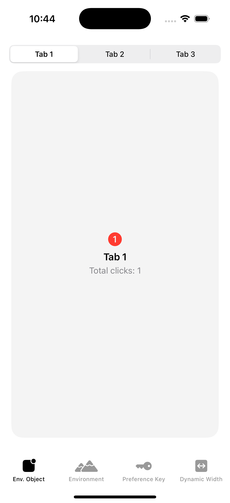
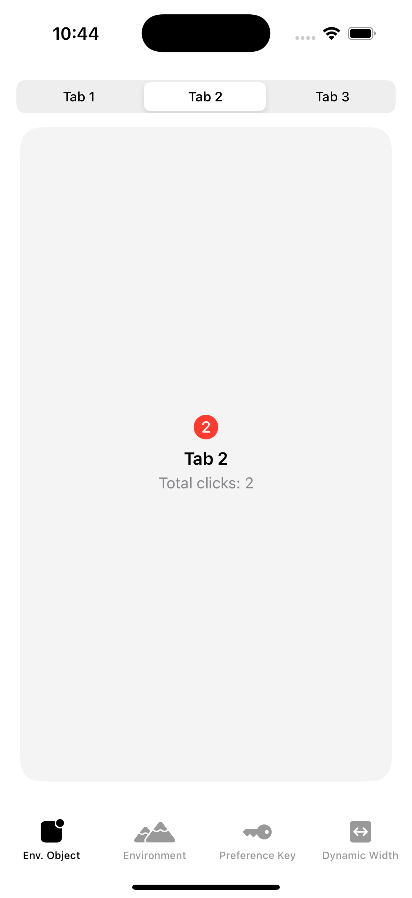
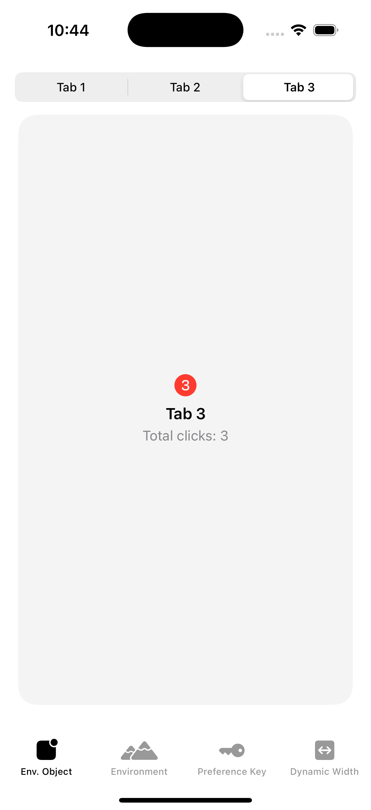
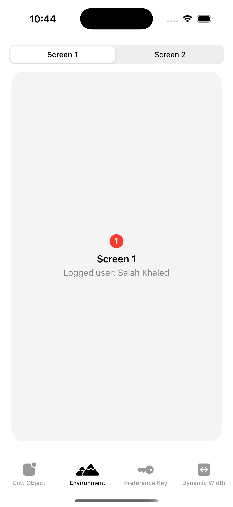
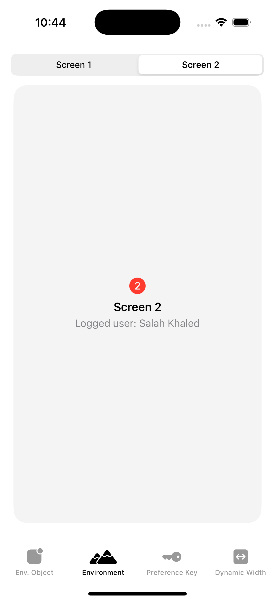
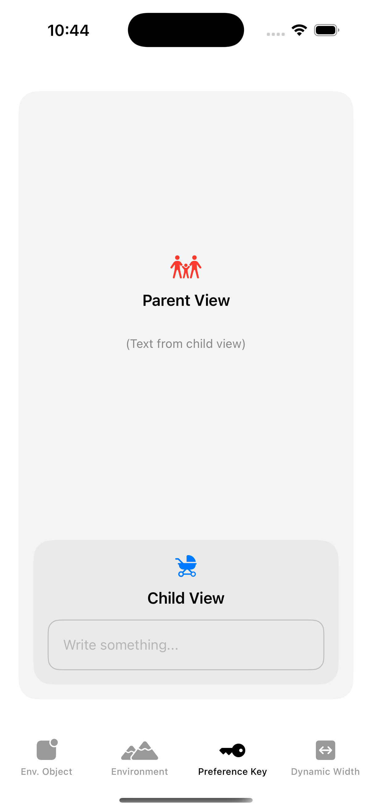
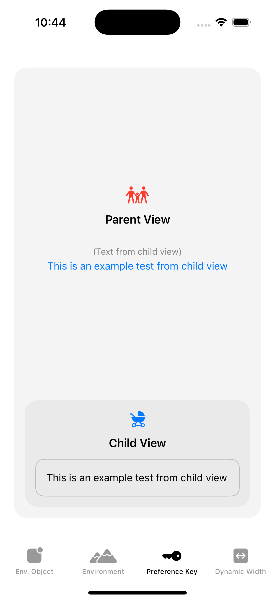
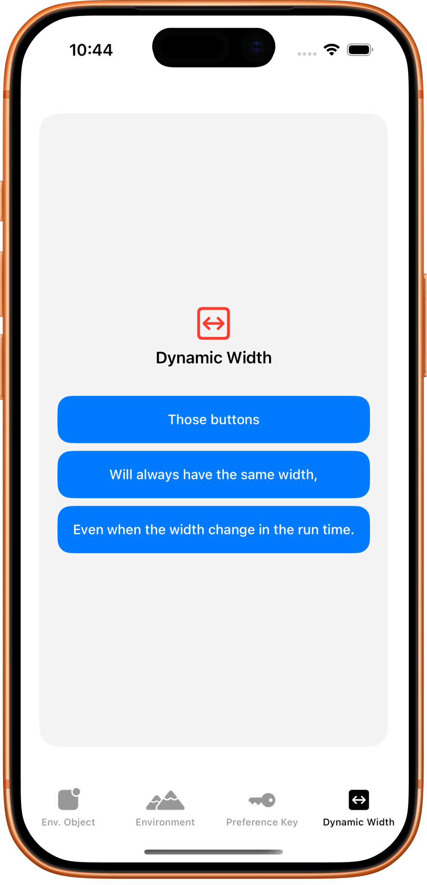

# DataFlow – SwiftUI Data Communication Examples

DataFlow is a SwiftUI demo project that showcases different techniques for passing data between views using modern SwiftUI patterns.

## App Structure

The application uses a `TabView` with four tabs:

1. **EnvironmentObject**
2. **Environment**
3. **PreferenceKey**
4. **Dynamic Width**

---

# 1️⃣ EnvironmentObject Example

### Concept:
Sharing observable state across multiple child views using `ObservableObject` and `@EnvironmentObject`.

### Key Components:
- `Analytics` class (`ObservableObject`)
- `@Published totalClick`
- `@StateObject` in parent
- `@EnvironmentObject` in children

### What It Does:
- Tracks total clicks across multiple internal tabs.
- Each child view calls `analytics.send(tag:)` inside `onAppear`.
- The shared `Analytics` instance updates `totalClick`.
- UI automatically updates because of `@Published`.

### Screenshot:

  
  &nbsp;&nbsp;&nbsp;
  
  &nbsp;&nbsp;&nbsp;
  

---

# 2️⃣ Environment Example

### Concept:
Passing dependencies down the view hierarchy using a custom `EnvironmentKey`.

### Key Components:
- `User` class
- `UserKey` conforming to `EnvironmentKey`
- `EnvironmentValues` extension

### What It Does:
- Injects a `User` instance into the environment.
- Child views access it using `@Environment(\.user)`.
- Logs the current username on appear.

### Screenshot:

  
  &nbsp;&nbsp;&nbsp;
  

---

# 3️⃣ PreferenceKey Example

### Concept:
Sending data **from child to parent** (reverse data flow).

### Key Components:
- `TextFieldPreferenceKey`
- `.preference(key:value:)`
- `.onPreferenceChange`

### What It Does:
- Child view contains a `TextField`.
- Text input is published using a `PreferenceKey`.
- Parent listens using `.onPreferenceChange`.
- Parent UI updates with the child’s text.

### Screenshot:

  
  &nbsp;&nbsp;&nbsp;
  

---

# 4️⃣ Dynamic Width Example

### Concept:
Synchronizing view sizes dynamically using `PreferenceKey` and `GeometryReader`.

### Key Components:
- `MaxWidthPreferenceKey`
- `SyncView`
- `SyncViewProxy`
- `syncWidth(using:)` modifier

### What It Does:
- Multiple buttons with different text lengths.
- All buttons automatically match the width of the widest button.
- Width updates dynamically at runtime.

### Screenshot:

  

---

# 🎯 Purpose of the Project

This project is designed as a practical reference for understanding:

- How data flows in SwiftUI
- Downward vs upward communication
- State management vs dependency injection
- Advanced layout coordination techniques
